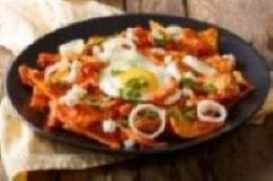

# El Sabor Mexicano - Meksika Restoranı Menüsü

Bu proje, sadece HTML kullanılarak hazırlanmış statik bir Meksika restoranı menüsü sayfasıdır. Menüde kahvaltı, ana yemekler ve tatlılar olmak üzere üç ana kategori bulunmaktadır.

## Menü İçeriği

- Kahvaltı: Huevos Rancheros, Chilaquiles, Pan de Elote gibi özgün Meksika kahvaltıları

 
 

- Ana Yemekler: Tacos al Pastor, Enchiladas Verdes, Quesadillas ve Carne Asada

 
 

- Tatlılar: Churros, Flan, Arroz con Leche

 
 

## Proje Özellikleri

- Menü öğeleri ve fiyatları listelenmiştir.  
- Her yemek için açıklayıcı görseller `` etiketi ile eklenmiş, boyutları sabitlenmiştir.  
- HTML5 semantik yapısı kullanılmıştır (`<header>`, `<main>`, `<section>`, `<footer>`).  
- Tamamen statik ve öğrenme amaçlıdır.

## Proje Linki

